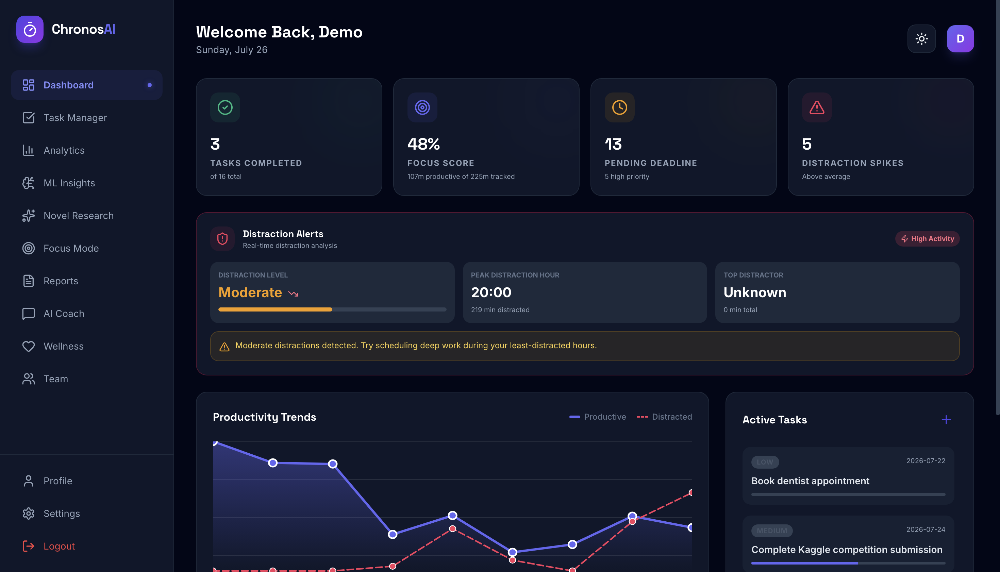
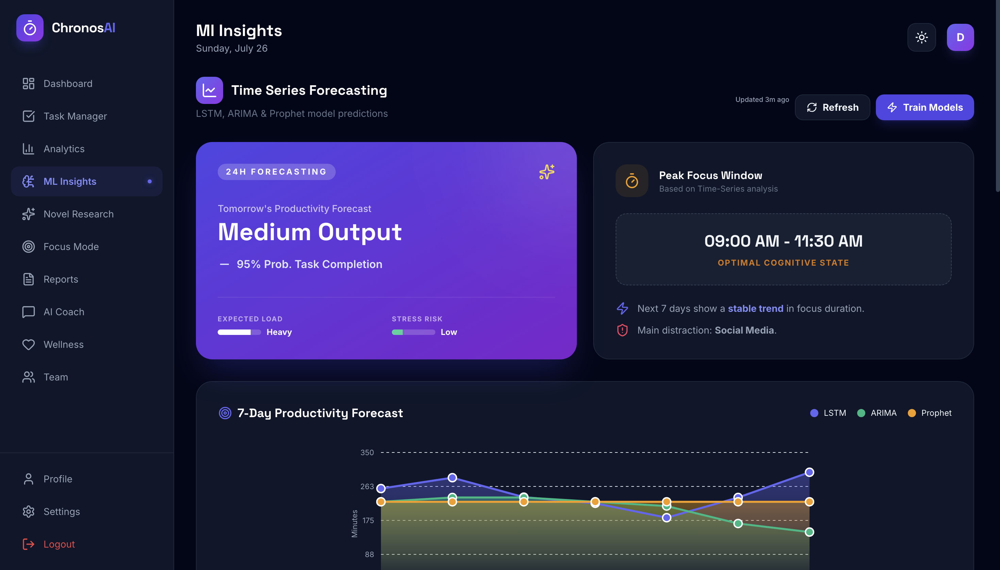
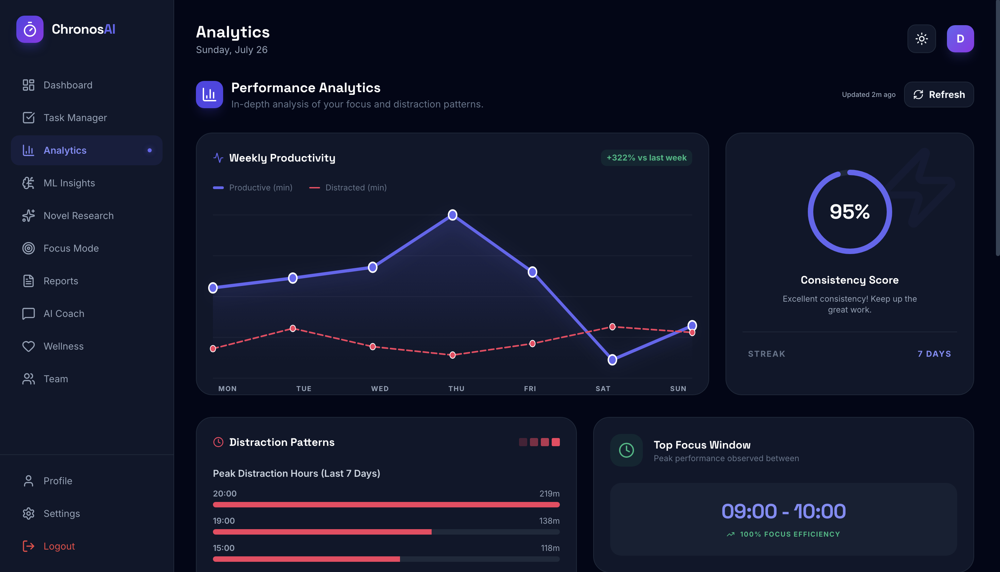
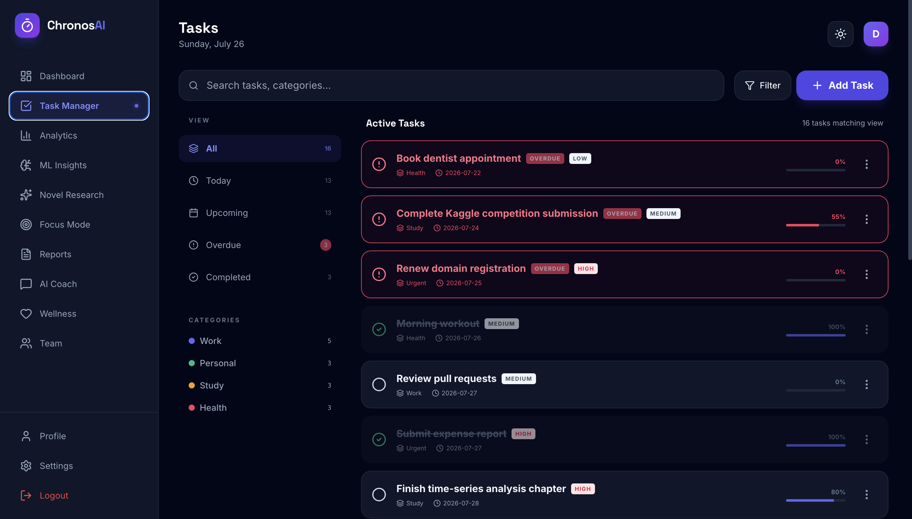
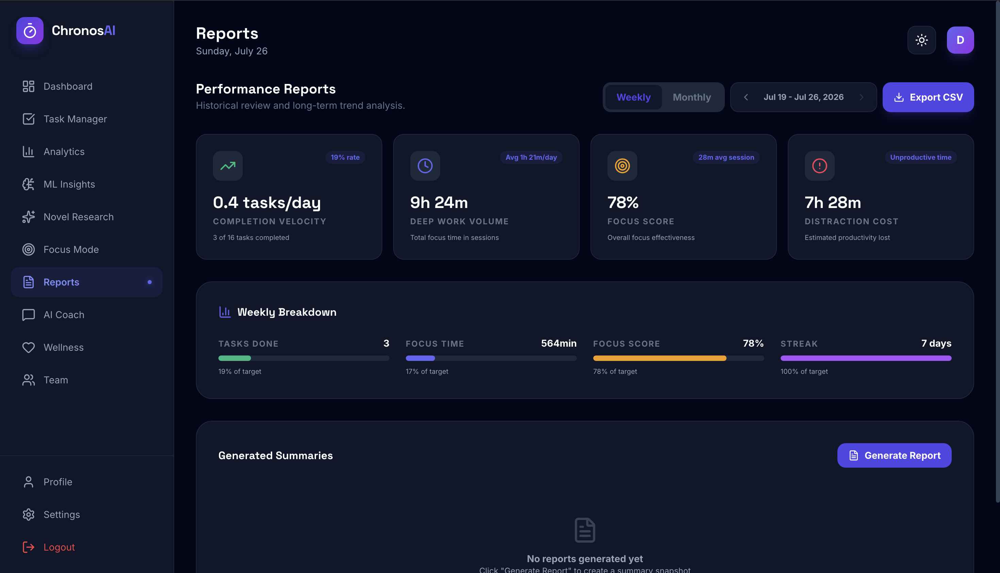
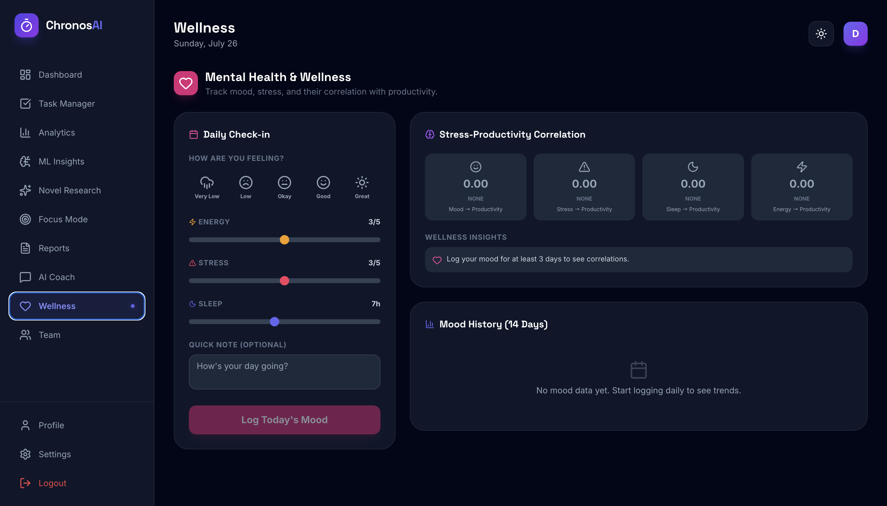

# FocusFlow

**An AI-powered productivity tracker that watches how you actually spend your day, then forecasts how tomorrow will go.**

FocusFlow passively tracks which applications and websites you use, classifies them as productive, distracting, or neutral, and feeds that time series into an ensemble of forecasting models (LSTM, ARIMA, Prophet) to predict your workload and completion probability for the next day. On top of the forecasting layer sit six behavioural-analytics features — SHAP explainability, a digital fatigue index, context-switch cost modelling, procrastination pattern mining, adaptive ensemble weighting, and a bidirectional mood ↔ productivity VAR model.

React + TypeScript frontend, Flask + MongoDB backend, scikit-learn / TensorFlow / statsmodels ML layer.

### Live demo

**[focusflow-frontend-l4o7.onrender.com](https://focusflow-frontend-l4o7.onrender.com)** — click **Try Demo Account**, or sign in with:

```
demo@focusflow.local  /  demo123
```

The demo account is preloaded with 90 days of activity history, 176 focus sessions and a 16-item task backlog, so every screen renders with real data.

> **Free-tier cold start.** Both services sleep after 15 minutes of inactivity. The first request wakes the backend and loads the ML stack, so give it **60–90 seconds** on the first load. Subsequent requests are ~1s, and forecasts ~3s.

API: [focusflow-api-cv8x.onrender.com/api/health](https://focusflow-api-cv8x.onrender.com/api/health)

---

## Table of Contents

- [Screenshots](#screenshots)
- [Screens & Features](#screens--features)
- [Architecture](#architecture)
- [Tech Stack](#tech-stack)
- [The ML Layer](#the-ml-layer)
- [Model Selection Study](#model-selection-study)
- [Running Locally](#running-locally)
- [Environment Variables](#environment-variables)
- [Deployment](#deployment)
- [API Reference](#api-reference)
- [Project Structure](#project-structure)
- [Known Limitations](#known-limitations)
- [License](#license)

---

## Screenshots

### Dashboard
Today's productive/distracted split, distraction alerts with peak hour and top distractor, productivity trend chart, and the active task list.



### ML Insights
Next-day forecast with expected load and stress risk, peak focus window, and a 7-day forecast plotting LSTM, ARIMA and Prophet predictions side by side.



### Analytics
Weekly productive-vs-distracted series, consistency score and streak, peak distraction hours, and the top focus window.



<details>
<summary><b>More screens</b> — Task Manager, Reports, Wellness</summary>

### Task Manager
Filterable backlog with priority, category, deadline, progress bars and overdue highlighting.



### Reports
Completion velocity, deep-work volume, focus score and distraction cost, with weekly/monthly ranges and CSV export.



### Wellness
Daily mood, energy, stress and sleep check-in, plus mood↔productivity correlation.



</details>

---

## Screens & Features

| Screen | What it does |
|---|---|
| **Dashboard** | Today's productive/distracted split, active task list, focus streak, next-day forecast summary |
| **Tasks** | CRUD task manager with priority, category, deadline, progress and overdue detection |
| **Analytics** | Hourly and weekly breakdowns, top applications, distraction patterns, peak focus windows |
| **ML Insights** | Side-by-side LSTM / ARIMA / Prophet forecasts, evaluation metrics, on-demand retraining |
| **Novel Insights** | The six research features — SHAP attribution, fatigue index, context-switch cost, procrastination triggers, adaptive ensemble weights, mood↔productivity causality |
| **Focus Mode** | Pomodoro-style focus sessions with session history and aggregate stats |
| **Reports** | Weekly report generation with behavioural pattern summaries |
| **Wellness** | Mood logging, mood history, and mood/productivity correlation |
| **Team** | Create or join a team, shared team dashboard |
| **AI Coach** | Chat assistant grounded in your own productivity context |
| **Settings / Profile** | Theme, account management, TOTP two-factor auth, data export and deletion |

### Automatic activity tracking

The backend runs a tracker thread that polls the OS foreground window every 10 seconds, resolves browser tabs to their underlying site (YouTube, GitHub, Stack Overflow, …) by parsing the window title, and writes a duration record to MongoDB each time you switch away from an app.

Tracking depends on `pygetwindow`, which is **Windows-only**. On Linux and macOS — and therefore on any cloud deployment — the import fails gracefully, the tracker disables itself, and every other feature continues to work against whatever data is already in the database.

---

## Architecture

```
┌──────────────────────────┐         ┌──────────────────────────────┐
│   React 19 + TypeScript  │         │      Flask REST API          │
│   Vite · Tailwind        │  HTTPS  │                              │
│                          │ ──JWT──▶│  8 blueprints, 60+ endpoints │
│  services/api.ts         │         │  bcrypt + PyJWT + TOTP       │
│  services/dataCache.ts   │         └───────────┬──────────────────┘
│  (30-min localStorage    │                     │
│   TTL cache)             │          ┌──────────┴──────────┐
└──────────────────────────┘          │                     │
                                ┌─────▼──────┐      ┌───────▼────────┐
                                │  MongoDB   │      │   ML Engine    │
                                │            │      │  (lazy-loaded) │
                                │ users      │      │ RandomForest   │
                                │ tasks      │      │ LSTM · ARIMA   │
                                │ activities │      │ Prophet · SHAP │
                                │ sessions   │      │ VAR/Granger    │
                                │ teams      │      └────────────────┘
                                └────────────┘
                                      ▲
                                      │
                          ┌───────────┴────────────┐
                          │  Activity Tracker      │
                          │  (background thread,   │
                          │   Windows only)        │
                          └────────────────────────┘
```

**Two design decisions worth calling out:**

1. **Lazy ML imports.** TensorFlow, Prophet, and statsmodels together add 10–15 seconds to a cold import. `backend/ml/__init__.py` exposes `get_<model>()` accessors that import and memoise each model on first use instead, which keeps Flask startup under a second — the difference between a healthy cloud deploy and one that times out.

2. **Client-side TTL cache.** `services/dataCache.ts` wraps every analytics fetch in a 30-minute `localStorage` cache, so navigating between pages is instant rather than re-triggering expensive model inference. Each page carries a manual **Refresh** button and an "updated *n* minutes ago" label so the staleness is always visible.

---

## Tech Stack

**Frontend** — React 19, TypeScript 5.8, Vite 6, Tailwind CSS, lucide-react

**Backend** — Flask 3, Flask-CORS, PyMongo, PyJWT, bcrypt, pyotp, gunicorn

**ML / Data** — scikit-learn, TensorFlow/Keras, statsmodels, pmdarima, Prophet, SHAP, pandas, NumPy

**Database** — MongoDB (Atlas in production)

**Hosting** — Render (Blueprint in [render.yaml](render.yaml))

---

## The ML Layer

### Core models

| Model | Implementation | Purpose |
|---|---|---|
| **Productivity Classifier** | Random Forest (`scikit-learn`) | Classifies a day's behaviour as Low / Medium / High productivity |
| **LSTM Forecaster** | TensorFlow/Keras, stacked LSTM + dropout | Captures non-linear multi-day patterns |
| **ARIMA Forecaster** | `statsmodels` + `pmdarima` auto-selection | Statistical trend and seasonality baseline |
| **Prophet Forecaster** | Meta's Prophet | Additive regression, robust to gaps and outliers |
| **Ensemble** | Weighted combination of the three | Final next-day workload and completion forecast |

Trained artifacts live in `backend/ml/models/` and `backend/ml/saved_models/`. Retrain from scratch with `python train_all_models.py`, or trigger a retrain through `POST /api/insights/ml/train`.

### Six behavioural-analytics features

| Feature | Method | Question it answers |
|---|---|---|
| **SHAP Explainability** | Shapley values over the classifier | *Which behaviours actually drove today's productivity score?* |
| **Digital Fatigue Index** | Composite score from session length, switch rate, and time-of-day | *Am I running on empty right now?* |
| **Context-Switch Cost** | Attention-residue model over switch sequences | *How much time am I losing to task-switching?* |
| **Procrastination Detector** | Sequential pattern mining over activity streams | *Which apps reliably precede a productivity collapse?* |
| **Adaptive Ensemble** | Per-user dynamic reweighting of the three forecasters | *Which model actually predicts me best?* |
| **Mood ↔ Productivity VAR** | Vector autoregression + Granger causality | *Does mood drive productivity, or the reverse?* |

The `POST /api/novel/ensemble-weights/simulate` endpoint replays alternative weightings against your own history, and `GET /api/novel/overview` returns all six in a single call.

---

## Model Selection Study

`selection_of_model/` contains the statistical work behind the ARIMA configuration — this is analysis, not application code, and runs standalone.

The pipeline (`01_` through `07_`) collects the series, tests stationarity with ADF and KPSS, reads ACF/PACF to bound the parameter search, then compares candidate orders by AIC/BIC:

| Model | AIC | BIC | Parameters |
|---|---|---|---|
| ARIMA(1,1,0) | 907.18 | 913.99 | 2 |
| ARIMA(0,1,1) | 890.12 | 896.93 | 2 |
| **ARIMA(1,1,1)** | **870.45** | **877.23** | 3 |

ARIMA(1,1,1) wins on both criteria; residual diagnostics (`05_residual_diagnostics.py`) confirm the residuals behave like white noise. Full write-up in [ARIMA_Model_Selection_Report.pdf](selection_of_model/ARIMA_Model_Selection_Report.pdf), with a step-by-step walkthrough in [FLOWCHART_GUIDE.md](selection_of_model/FLOWCHART_GUIDE.md).

---

## Running Locally

**Prerequisites** — Node.js 18+, Python 3.11, and a MongoDB instance (local or Atlas).

### 1. Backend

```bash
cd backend
python -m venv venv
source venv/bin/activate          # Windows: venv\Scripts\activate
pip install -r requirements.txt

cp .env.example .env              # then edit .env
python app.py                     # → http://localhost:5000
```

> Installing TensorFlow, Prophet, and pmdarima takes a few minutes on a cold environment. This is expected.

To get a throwaway login without registering, set `SEED_DEMO_USER=true` in `.env` before starting — the server creates the account from `DEMO_USER_EMAIL` / `DEMO_USER_PASSWORD`. Leave it `false` anywhere public.

### 2. Frontend

```bash
npm install
npm run dev                       # → http://localhost:3000
```

The frontend reads `VITE_API_URL` and falls back to `http://localhost:5000/api`, so no frontend config is needed for local development.

### 3. Optional — train the models

```bash
cd backend
python train_all_models.py
```

Without this the API still runs; forecasting endpoints fall back to the checked-in artifacts.

---

## Environment Variables

### Backend (`backend/.env`)

| Variable | Required | Default | Notes |
|---|---|---|---|
| `MONGO_URI` | **yes** | `mongodb://localhost:27017/` | Connection string |
| `MONGO_DB_NAME` | no | `focusflow` | Database name |
| `SECRET_KEY` | **in prod** | dev placeholder | Flask session key |
| `JWT_SECRET` | **in prod** | dev placeholder | Token signing key |
| `JWT_EXPIRATION_HOURS` | no | `24` | Token lifetime |
| `CORS_ORIGINS` | **in prod** | localhost origins | Comma-separated allowlist |
| `DEBUG` | no | `True` | Set `false` in production |
| `GEMINI_API_KEY` | no | — | Enables the AI coach; without it `/api/insights/chat` returns 503 and everything else works |
| `SEED_DEMO_USER` | no | `false` | Creates a demo account on boot |
| `DEMO_USER_EMAIL` | no | `demo@focusflow.local` | Only used when seeding |
| `DEMO_USER_PASSWORD` | no | `demo123` | Only used when seeding. Must match the credentials the frontend's *Try Demo Account* button sends (see [components/Auth.tsx](components/Auth.tsx)) |

### Frontend

| Variable | Required | Default | Notes |
|---|---|---|---|
| `VITE_API_URL` | in prod | `http://localhost:5000/api` | Base API URL. A missing or extra `/api` suffix is normalised at runtime by `normaliseApiBase` in [services/api.ts](services/api.ts) |

`VITE_API_URL` is inlined by Vite **at build time**, not read at runtime — after changing it on the host you must trigger a rebuild with the cache cleared, or the old value stays baked into the bundle.

---

## Deployment

The repo ships a Render Blueprint ([render.yaml](render.yaml)) defining both services:

- **`focusflow-api`** — Python web service, gunicorn, health check on `/api/health`
- **`focusflow-frontend`** — static site built with `npm ci && npm run build`, SPA rewrite to `index.html`

**To deploy:**

1. Push this repository to GitHub.
2. In Render, create a new **Blueprint** and point it at the repo. (Blueprints require a payment method on file; the same two services can be created by hand on the free tier instead.)
3. Supply `MONGO_URI` when prompted (`SECRET_KEY` and `JWT_SECRET` are auto-generated).
4. Optionally set `GEMINI_API_KEY` to enable the AI coach.
5. Once both services are live, set `CORS_ORIGINS` on the API to the real frontend URL and `VITE_API_URL` on the frontend to the real API URL, then redeploy the frontend **with the build cache cleared**.

Step 5 matters because `render.yaml` hardcodes the two service URLs. If either name is already taken, Render appends a suffix and the services no longer point at each other.

**Notes on the free tier:**

- Services spin down when idle; the first request after a lull takes 60–90 seconds to cold-start. Measured on the live deployment: first `/api/insights/forecast` call **70.8s**, subsequent calls **~3.4s**.
- Run gunicorn with **one worker**. Each worker loads its own copy of TensorFlow, and two will exhaust the 512 MB free instance. Render sets `WEB_CONCURRENCY=1` automatically based on available CPUs.
- The ML dependency set is heavy (TensorFlow alone is a 620 MB wheel). The lazy-import design in `backend/ml/__init__.py` is what keeps startup inside Render's budget — the health check and all CRUD routes respond without ever importing TensorFlow, and if the ML import does fail the forecast endpoint degrades to a heuristic rather than erroring.

Vercel and Netlify can host the frontend, but not this backend — a long-lived Flask process with a background thread and a large native dependency tree doesn't fit a serverless runtime. Render or Railway are the right shape for the API.

---

## API Reference

All routes are prefixed with `/api`. Everything except `/health`, `/auth/register`, and `/auth/login` requires an `Authorization: Bearer <token>` header.

<details>
<summary><b>Auth</b> — <code>/api/auth</code></summary>

| Method | Endpoint | Description |
|---|---|---|
| `POST` | `/register` | Create account, returns JWT |
| `POST` | `/login` | Authenticate, returns JWT |
| `GET` | `/profile` | Current user |
| `PUT` | `/profile` | Update profile |
| `DELETE` | `/account` | Delete account |
| `POST` | `/clear-data` | Wipe user data, keep account |
| `POST` | `/2fa/setup` · `/2fa/verify` · `/2fa/disable` | TOTP two-factor auth |

</details>

<details>
<summary><b>Tasks</b> — <code>/api/tasks</code></summary>

| Method | Endpoint | Description |
|---|---|---|
| `GET` · `POST` | `/` | List / create |
| `GET` · `PUT` · `DELETE` | `/<task_id>` | Read / update / delete |
| `GET` | `/stats` | Completion statistics |

</details>

<details>
<summary><b>Activities</b> — <code>/api/activities</code></summary>

| Method | Endpoint | Description |
|---|---|---|
| `GET` · `POST` | `/` | List / log activity |
| `POST` | `/batch` | Bulk insert |
| `GET` | `/summary` · `/weekly` · `/hourly` | Aggregations |

</details>

<details>
<summary><b>Focus Sessions</b> — <code>/api/focus</code></summary>

| Method | Endpoint | Description |
|---|---|---|
| `POST` | `/start` · `/end` · `/end/<id>` | Session lifecycle |
| `GET` | `/active` · `/history` · `/stats` | Current, past, aggregate |

</details>

<details>
<summary><b>Insights & ML</b> — <code>/api/insights</code></summary>

| Method | Endpoint | Description |
|---|---|---|
| `GET` | `/dashboard` | Dashboard payload |
| `GET` | `/forecast` | Ensemble next-day forecast |
| `GET` | `/trends` · `/behavioral-patterns` | Time series and patterns |
| `GET` | `/top-apps` · `/distraction-patterns` · `/focus-windows` | Behavioural breakdowns |
| `GET` | `/reports/weekly` | Weekly report |
| `GET` | `/ml/status` · `/ml/compare` · `/ml/evaluation-metrics` | Model introspection |
| `GET` | `/ml/forecast/<model>` · `/ml/realtime-predictions` | Per-model forecasts |
| `POST` | `/ml/train` | Retrain |
| `POST` | `/chat` | AI coach |
| `POST` · `GET` | `/mood/log` · `/mood/history` · `/mood/correlation` | Wellness |

</details>

<details>
<summary><b>Novel Features</b> — <code>/api/novel</code></summary>

| Method | Endpoint | Description |
|---|---|---|
| `GET` | `/overview` | All six features in one call |
| `GET` | `/shap` | Feature attribution |
| `GET` | `/fatigue` | Digital fatigue index |
| `GET` | `/context-switch` | Switch cost analysis |
| `GET` | `/procrastination` | Procrastination triggers |
| `GET` | `/ensemble-weights` | Current adaptive weights |
| `POST` | `/ensemble-weights/simulate` | Replay alternative weightings |
| `GET` | `/mood-productivity` | VAR / Granger causality |

</details>

<details>
<summary><b>Team & Tracker</b></summary>

| Method | Endpoint | Description |
|---|---|---|
| `POST` | `/api/team/create` · `/join` · `/leave` | Membership |
| `GET` | `/api/team/dashboard` | Shared dashboard |
| `POST` | `/api/tracker/start` · `/stop` | Activity tracker control |
| `GET` | `/api/health` | Health check (unauthenticated) |

</details>

---

## Project Structure

```
FocusFlow/
├── App.tsx                     # Root component, routing, auth state
├── index.tsx / index.html      # Vite entry
├── types.ts                    # Shared TypeScript types
├── components/                 # 15 feature screens
│   ├── Dashboard.tsx  Analytics.tsx  MLInsights.tsx
│   ├── NovelInsights.tsx  FocusMode.tsx  TaskManager.tsx
│   ├── Reports.tsx  Wellness.tsx  Team.tsx  ChatBot.tsx
│   └── Auth.tsx  Onboarding.tsx  Profile.tsx  Settings.tsx  Sidebar.tsx
├── services/
│   ├── api.ts                  # Typed API client, JWT handling
│   └── dataCache.ts            # 30-min localStorage TTL cache
│
├── backend/
│   ├── app.py                  # Flask entry, CORS, activity tracker
│   ├── config.py               # Env-driven configuration
│   ├── seed.py                 # Database seeding
│   ├── train_all_models.py     # Train every model
│   ├── models/                 # Mongo document models
│   ├── routes/                 # 8 blueprints
│   ├── ml/                     # ML engine (lazy-loaded)
│   │   ├── productivity_classifier.py  lstm_forecaster.py
│   │   ├── arima_forecaster.py  time_series_forecaster.py
│   │   ├── shap_explainer.py  fatigue_index.py
│   │   ├── context_switch.py  procrastination_detector.py
│   │   ├── adaptive_ensemble.py  mood_productivity_var.py
│   │   └── models/ saved_models/       # Trained artifacts
│   ├── dataset/                # Training dataset
│   └── utils/                  # DB connection, auth middleware
│
├── selection_of_model/         # ARIMA model-selection study
├── docs/screenshots/           # README screenshots
└── render.yaml                 # Render Blueprint
```

---

## Known Limitations

- **Activity tracking is Windows-only.** `pygetwindow` has no Linux/macOS equivalent here, so on other platforms the tracker disables itself and the app runs on previously collected or seeded data.
- **Cold starts on free hosting.** The first request after idle takes 50–90 seconds while the service spins back up and the lazy ML imports warm.
- **The AI coach needs a key.** Without `GEMINI_API_KEY`, `/api/insights/chat` returns 503; nothing else is affected.
- **Forecast quality scales with history.** The models need roughly two weeks of tracked activity before predictions are meaningful.
- **Tailwind is loaded from CDN** rather than compiled, which is convenient in development but not what you'd ship at scale.

---

## License

Released under the [MIT License](LICENSE).
